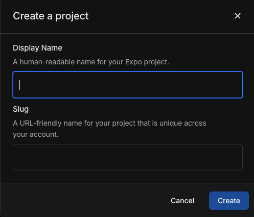
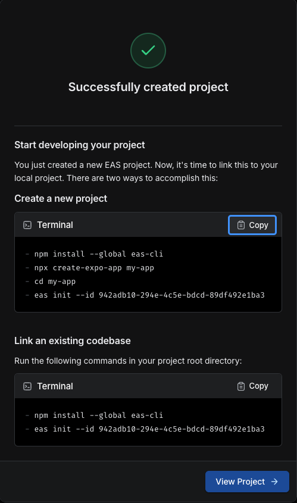

# Config scheme (android & ios) with EAS

Many times when developing an application, we developers need to create different builds with different configurations. Facilitating the maintenance and testing process. Usually 3 different builds are created: **development**, **staging** and **production**.

## Requiremnts

```bash
npm install -g eas-cli

eas login
```

## Create new project in EAS

1. Go to https://expo.dev/accounts/your_account_name/projects and click `Create a Project` button then a popup will be shown:



2. Fill all required informations and click `Create` and the popup success will be shown.



3. Update EAS values to .env file

```bash
# .env.development .env.staging .env.production

# example from step 2: 942adb10-294e-4c5e-bdcd-89df492e1ba3
EAS_PROJECT_ID=your_eas_project_id

# format URL: https://u.expo.dev/your_eas_project_id
EAS_PROJECT_URL=your_eas_project_url

# your account name
EAS_PROJECT_OWNER=your_eas_project_owner
```

> Notes:
> Refer documentation for more information: https://docs.expo.dev/build/setup/

## Config new environment variables

If you want to add more env variables, here is steps to create new variables inside .env files

1. Go to eas.json in root folder, there is a object `env` contains env variables can be used

```bash
"channel": "production",
"env": {
    "APP_ENV": "$APP_ENV",
    "APP_SCHEME": "$APP_SCHEME",
    "APP_NAME": "$APP_NAME",
    "APP_ID": "$APP_ID",
    "EAS_PROJECT_ID": "$EAS_PROJECT_ID",
    "EAS_PROJECT_URL": "$EAS_PROJECT_URL",
    "EAS_PROJECT_OWNER": "$EAS_PROJECT_OWNER",
    "API_URL": "$API_URL"
}
...
```

2. Add new variable into `env` object:

```bash
"channel": "production",
"env": {
    "APP_ENV": "$APP_ENV",
    "APP_SCHEME": "$APP_SCHEME",
    "APP_NAME": "$APP_NAME",
    "APP_ID": "$APP_ID",
    "EAS_PROJECT_ID": "$EAS_PROJECT_ID",
    "EAS_PROJECT_URL": "$EAS_PROJECT_URL",
    "EAS_PROJECT_OWNER": "$EAS_PROJECT_OWNER",
    "API_URL": "$API_URL",
    "NEW_VARIABLE": "$NEW_VARIABLE", // new added variable
}
...
```

> Notes: this variables can be initialized in all schemes `development` `staging` `production` since this **env** is extends from other schemes as well

```bash
"staging": {
    ...
    "env": {
        "extends": "production"
    },
    ...
}
```

3. Add new variable `NEW_VARIABLE` in all .env schemes

```bash
# .env.development .env.staging .env.production
NEW_VARIABLE=NEW_VARIABLE_VALUES
```

4. Define variable in app.config.js

```bash
export default ({config}) => ({
...
extra: {
    ...config.extra,
    API_URL: process.env.API_URL,
    APP_ENV: process.env.APP_ENV,
    APP_ID: process.env.APP_ID,
    APP_NAME: process.env.APP_NAME,
    APP_SCHEME: process.env.APP_SCHEME,
    PROJECT_NAME: process.env.PROJECT_NAME,
    # new variable here
    NEW_VARIABLE: process.env.NEW_VARIABLE
    eas: {
      projectId: process.env.EAS_PROJECT_ID,
    }
  }
...
```

4. To use it, go to src/constants/configs.ts folder, add variable in configs to use new variable

```bash
export const EXPO_ENV_VARIABLES = Constants.expoConfig?.extra

const configs = {
  appVersion: packageJSON.version,
  APP_ENV: EXPO_ENV_VARIABLES?.APP_ENV ?? 'dev',
  DEBUG_ENABLED: EXPO_ENV_VARIABLES?.APP_ENV !== AppEnv.PRODUCTION,
  API_URL: EXPO_ENV_VARIABLES?.API_URL,
  buildEvn: EXPO_ENV_VARIABLES?.APP_ENV,
  projectName: EXPO_ENV_VARIABLES?.PROJECT_NAME,
  # add new variable
  newVar: EXPO_ENV_VARIABLES?.NEW_VARIABLE
}

  # Simply import `@/constants/configs` and call `configs.newVar` to use it
```

5. Another wait is use directly with `EXPO_ENV_VARIABLES?.NEW_VARIABLE`
